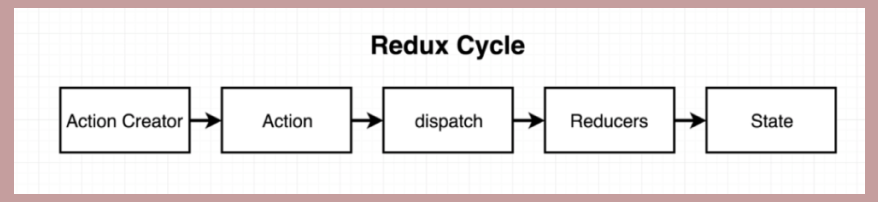
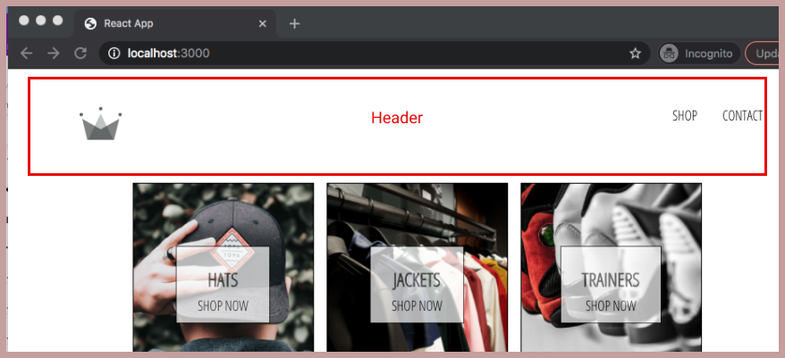
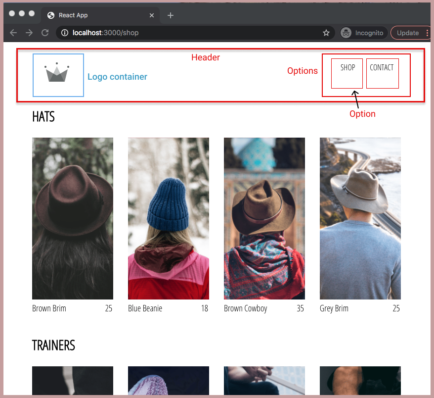
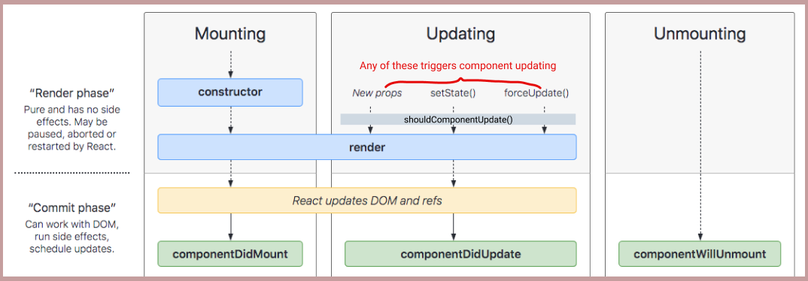
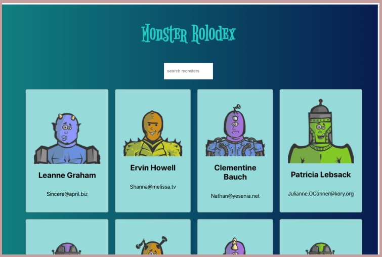

# 30-days-of-code-log-r1

| Log 1 |
| --- |
| [30 Days Round 1]

## Challenge & Commitment
This is my version of the 100 days of code, personally what works for me is a shorter timescale, hence my 30 days challenge.

**Commitment:** *I will code daily for the next 30 days.*

|  Start Date   | End Date     |
| ------------- | ------------ |
| March 8, 2021   | April 6, 2021 |

## Goals

- [ ] Complete daily code challenge (codewars etc)
- [ ] Pass the OpenJS Node JS Application Development(JSNAD) Exam
- [ ] Pass the OpenJS Node JS Services Developer(JSNSD) Exam
- [ ] Complete first "The complete react developer in 2021" course
- [ ] Complete second "Advanced react and redux" course
- [ ] Books - read first "The Checklist Manifesto" by Atul Gawande
- [ ] Books - read second "Make it Stick" by Brown, Roediger & McDaniel

&nbsp;  

### Code Log
---

## 6 - Redux ##
### Day 6: March 13, 2021 - Saturday

|  Code Challenge | Exam Prep: JSNAD | Exam Prep: JSNSD | Course: React dev | Course: Adv React | Read: Checklist Manifesto  | Read: Make it Stick |
| ------ | ------ | ------ | ------ | ------ | ------ | ------  
| 5/30 | 0/30 | 0/30 | 6/30 | N/A | 6/30 | N/A |

                -----------------------------------------------------------------------------

**1. Code Challenge:**
   CodeWars: None done today, spent time on going deep into Redux

                -----------------------------------------------------------------------------

**2. Course: "The complete react developer in 2021"**

- Took a step away and went a bit deeper into Redux. Create a small none React use of Redux together with a detailed readme.
  
described the Redux cycle below in a detailed and easy to understand way (see Redux-learn in links).

                -----------------------------------------------------------------------------

**3. Book: "The Checklist Manifesto"**
   - Read: Ch. 7 The Test
     - Key takeout(s):
     - The checklist must be used out in the field, with a controlled user group and fully monitored. Albeit this was for a surgical checklist, but even if doing it for a software project, would need some form of governance and monitoring in place.
     

**Links:**
- Redux:  
   - Redux-learn - [Readme & notes](https://github.com/dmh247365/redux-learn/blob/main/README.md)
   - Redux-learn - [JS](https://github.com/dmh247365/redux-learn/blob/main/app.js)

---

## 5 - Forms ##
### Day 5: March 12, 2021 - Friday

|  Code Challenge | Exam Prep: JSNAD | Exam Prep: JSNSD | Course: React dev | Course: Adv React | Read: Checklist Manifesto  | Read: Make it Stick |
| ------ | ------ | ------ | ------ | ------ | ------ | ------  
| 5/30 | 0/30 | 0/30 | 5/30 | N/A | 5/30 | N/A |

                -----------------------------------------------------------------------------

**1. Code Challenge:**
   CodeWars: 
    CodeWars:  7kyu find next perfect square - completed

                -----------------------------------------------------------------------------

**2. Course: "The complete react developer in 2021"**

- Built the sign in form, and created a button component which can be re-used. 

                -----------------------------------------------------------------------------

**3. Book: "The Checklist Manifesto"**
   - Read: Ch. 6 The Checklist Factory
     - Key takeout(s):
     - Aircraft industry - electronic/hefty volumes of checklists
     - Updates send out aircraft manufacturers
     - Good checklists are precise. They are efficient, to the point, and easy to use even in the most difficult situations. They do not try to spell out everything - a checklist cannot fly a plane. Instead they provide a reminders of only the most critical and important steps - the ones that even the highest skilled professionals using them could miss. Good checklists are, above all practical.

**Links:**
- Code Challenge:  
    - Find next perfect square - [Readme & notes](https://github.com/dmh247365/javascript-code-challenges/blob/main/CodeWars/7kyu/7kyu-find-the-next-perfect-square.md)
    - Find next perfect square - [JS Solution(s)](https://github.com/dmh247365/javascript-code-challenges/blob/main/CodeWars/7kyu/7kyu-find-the-next-perfect-square.js)

---

## 4 - Add page & header, use react router ##
### Day 4: March 11, 2021 - Thursday

|  Code Challenge | Exam Prep: JSNAD | Exam Prep: JSNSD | Course: React dev | Course: Adv React | Read: Checklist Manifesto  | Read: Make it Stick |
| ------ | ------ | ------ | ------ | ------ | ------ | ------  
| 4/30 | 0/30 | 0/30 | 4/30 | N/A | 4/30 | N/A |

                -----------------------------------------------------------------------------

**1. Code Challenge:**
   CodeWars: 
    CodeWars: 7kyu exes and ohs - completed

                -----------------------------------------------------------------------------

**2. Course: "The complete react developer in 2021"**
  - Completed the shop page which display items over 4 columns.
  - Built a header component which is used across different pages.

                -----------------------------------------------------------------------------

**3. Book: "The Checklist Manifesto"**
   - Read: Ch.5 The First Try
     - Key takeout(s):
     - Even a top surgeons can get a checklist wrong.
     - Involve those who will be using it.
     - Have a go but be ready to scrap/redo or tweak if necessary, its not carved in stone.

**Links:**
- Code Challenge:  
    - Exes and ohs - [Readme & notes](https://github.com/dmh247365/javascript-code-challenges/blob/main/CodeWars/7kyu/7kyu-exes-and-ohs.md)
    - Exes and ohs - [JS Solution(s)](https://github.com/dmh247365/javascript-code-challenges/blob/main/CodeWars/7kyu/7kyu-exes-and-ohs.js)

---

## 3 - Split page into components ##
### Day 3: March 10, 2021 - Wednesday

|  Code Challenge | Exam Prep: JSNAD | Exam Prep: JSNSD | Course: React dev | Course: Adv React | Read: Checklist Manifesto  | Read: Make it Stick |
| ------ | ------ | ------ | ------ | ------ | ------ | ------  
| 3/30 | 0/30 | 0/30 | 3/30 | N/A | 3/30 | N/A |

                -----------------------------------------------------------------------------

**1. Code Challenge:**
   CodeWars: 
    CodeWars: 7kyu range bit counting - completed

                -----------------------------------------------------------------------------

**2. Course: "The complete react developer in 2021"**
  - Started building E Commerce site in React 
    - Did Homepage and broke it down into components 
    - Used Sass - which is css with superpowers

                -----------------------------------------------------------------------------

**3. Book: "The Checklist Manifesto"**
   - Read: Ch.4 The Idea
     - Key takeout(s):
     - Checklists are everywhere, professional football coordinators, stage sets, professional kitchens.
     - The Checklist must also permit discussion on an concerns etc.

**Links:**
- Code Challenge:  
    - Range bit counting - [Readme & notes](https://github.com/dmh247365/javascript-code-challenges/blob/main/CodeWars/7kyu/7kyu-range-bit-counting.md)
    - Range bit counting - [JS Solution(s)](https://github.com/dmh247365/javascript-code-challenges/blob/main/CodeWars/7kyu/7kyu-range-bit-counting.js)

---

## 2 - Component Lifecycle ##
### Day 2: March 9, 2021 - Tuesday

|  Code Challenge | Exam Prep: JSNAD | Exam Prep: JSNSD | Course: React dev | Course: Adv React | Read: Checklist Manifesto  | Read: Make it Stick |
| ------ | ------ | ------ | ------ | ------ | ------ | ------  
| 2/30 | 0/30 | 0/30 | 2/30 | N/A | 2/30 | N/A |

                -----------------------------------------------------------------------------

**1. Code Challenge:**
   CodeWars: 7kyu sum of odd numbers - completed

                -----------------------------------------------------------------------------

**2. Course: "The complete react developer in 2021"**
  - Going through the lifecycle of a component, which consists of three main phases:-
  
    - Mounting: done first
      - constructor()
      - render()
      - componentDidMount()
    - Updating: we can put in `shouldComponentUpdate()` with a ternary operator, so as to render or not.
      - render()
      - componentDidUpdate()
    - Unmounting: when done, component is forgotten about by DOM.
      - componentWillUnmount()  

                -----------------------------------------------------------------------------

**3. Book: "The Checklist Manifesto"**
   - Read: Ch.2 The Checklist & Ch.3 The end of the Master Builder
     - Key takeout(s):
     - Checklist should be simple, brief and to the point. Checklists establish a higher standard of baseline performance.
     - Complex problems cannot be solved by one person, group ownership, responsibility and visible accountability is the key.

**Links:**
- Code Challenge:  
    - Sum of odd numbers - [Readme & notes](https://github.com/dmh247365/javascript-code-challenges/blob/main/CodeWars/7kyu/7kyu-sum-of-odd-numbers.md)
    - Sum of odd numbers - [JS Solution(s)](https://github.com/dmh247365/javascript-code-challenges/blob/main/CodeWars/7kyu/7kyu-sum-of-odd-numbers.js)

---

## 1 - React Intro ##
### Day 1: March 8, 2021 - Monday

|  Code Challenge | Exam Prep: JSNAD | Exam Prep: JSNSD | Course: React dev | Course: Adv React | Read: Checklist Manifesto  | Read: Make it Stick |
| ------ | ------ | ------ | ------ | ------ | ------ | ------  
| 1/30 | 0/30 | 0/30 | 1/30 | N/A | 1/30 | N/A |

                -----------------------------------------------------------------------------

**1. Code Challenge:**
   CodeWars: 7kyu Vaporcode - completed

                -----------------------------------------------------------------------------

**2. Course: "The complete react developer in 2021"**
  - Covering the basics of React, using create react app, pulling simple data from 3rd party api and hosting with github pages.
  - Drilled in that we need to always consider the following three items 
    - Decide on Components
    - Decide the State and where it lives
    - What changes when state changes

  Built a simple app that displays inform on cards from a third party api, and which we can perform a simple search on.
  
  

                -----------------------------------------------------------------------------

**3. Book: "The Checklist Manifesto"**
   - Read: Intro & Ch.1 The problem of extreme complexity 
     - Key takeout(s):
     - 'one needs to practice to achieve mastery, a body of experience before one achieves real success.'
     - However that alone is not the answer as mistakes are still made by even the most well trained and intentioned individuals. 

**Links:**
- Code Challenge:  
    - Vaporcode - [Readme & notes](https://github.com/dmh247365/javascript-code-challenges/blob/main/CodeWars/7kyu/7kyu-vaporcode.md)
    - Vaporcode - [JS Solution(s)](https://github.com/dmh247365/javascript-code-challenges/blob/main/CodeWars/7kyu/7kyu-vaporcode.js)

- The Complete React Developer:
  -  Monster Rolodex - [React](https://dmh247365.github.io/monsters-rolodex)
